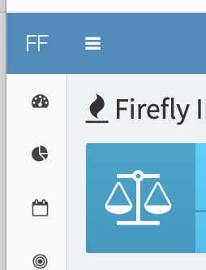

# Treasury Direct Password Enable User Script

A userscript to automatically hide the sidebar in Firefly III by default on page load.

Want the sidebar in <a href="https://www.firefly-iii.org/">Firefly III</a> to be hidden by default when you load the page?

This user script is for you.

Unfortunately, there will not be a native Firefly III feature implemented to hide the sidebar by default - see <a href="https://github.com/firefly-iii/firefly-iii/issues/9735">firefly-iii/firefly-iii#9735</a> for details. This user script is a workaround to achieve this functionality.

## Installation

[Click here to install](https://raw.githubusercontent.com/ChrisCarini/firefly-iii-hide-sidebar-by-default-userscript/main/firefly-iii-hide-sidebar-by-default.user.js)

_(**Note:** Your user script manager (see [Prerequisites](#Prerequisites) section below) should prompt you to install.)_

## Prerequisites

1) You will need a user script manager installed on the browser you wish to use Firefly III with.

[Tampermonkey](https://www.tampermonkey.net/) (no affiliation) is a common user script manager.

Below are links for the extension for common browsers below:

- [Chrome](https://chrome.google.com/webstore/detail/tampermonkey/dhdgffkkebhmkfjojejmpbldmpobfkfo)
- [Firefox](https://addons.mozilla.org/en-US/firefox/addon/tampermonkey/)
- [Safari](https://apps.apple.com/app/apple-store/id1482490089)
- [Microsoft Edge](https://microsoftedge.microsoft.com/addons/detail/tampermonkey/iikmkjmpaadaobahmlepeloendndfphd)
- [Opera](https://addons.opera.com/en/extensions/details/tampermonkey-beta/)

## Support

Need support with the userscript? Feel free to open an issue on this repository.

Need support with Firefly III? Please refer to the [Firefly III documentation](https://docs.firefly-iii.org/).